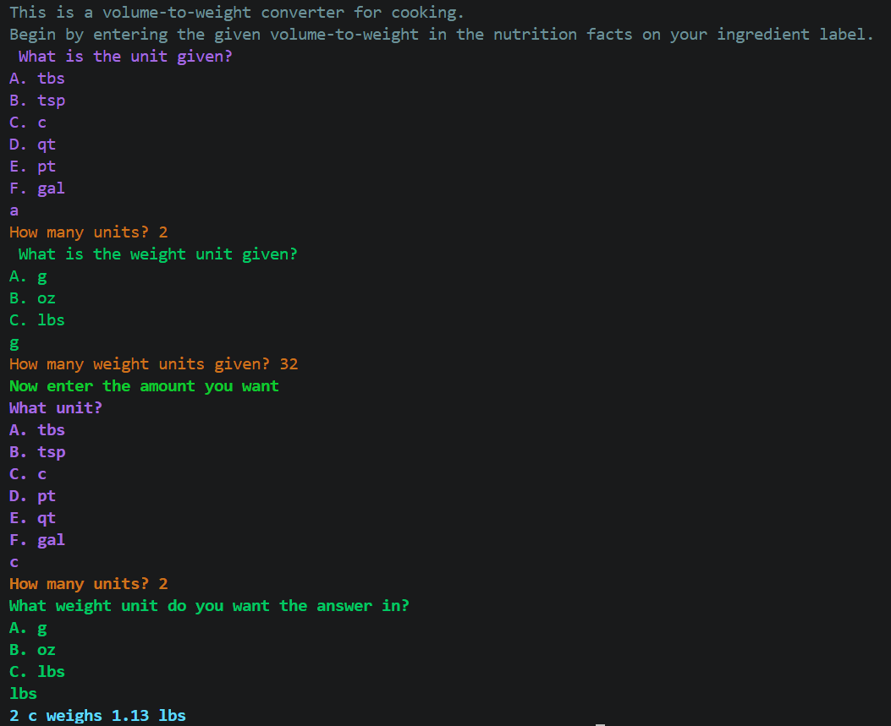

# Volume to Weight Converter
**This is a Python script to make cooking easier by quickly determining any amount of an ingredient to its weight. For example, it could take the '2 tbs (32g)' on an Nutrition Facts label and tell you how much 2 cups weighs.**

## Quick start
1. Download weight_converter.exe from the [Releases](github.com/Abracadabra3/weight_converter/releases/tag/1.0) page
1. Run the file

Or of you don't want to download the .exe:

1. Run `pip install pyinputplus` in your python environment
1. Download [weight_converter.py](code/weight_converter.py) or copy and paste code and run the file.
## Features
- Takes input in all common US measuring sizes
- Accepts grams, ounces, and pounds as weight units
- Outputs weight in whatever weight and volume unit you want
- Uses Python 3.13 and [PyInputPlus](pyinputplus.readthedocs.io/en/latest/)
- Formatted as both a .py and .exe file

## Design decisions
The use of PyInputPlus makes it easy to provide valid input without guessing what the code is expecting.

Colored text printed to the terminal makes it easy to see whether you are supossed to input volume units, weight units, or numbers. This also prevents the terminal from becoming a wall of text.
The book [Automate the Boring Stuff with Python, by Al Sweigart](https://automatetheboringstuff.com/3e/chapter0.html) had information about PyInputPlus and formatting strings.
